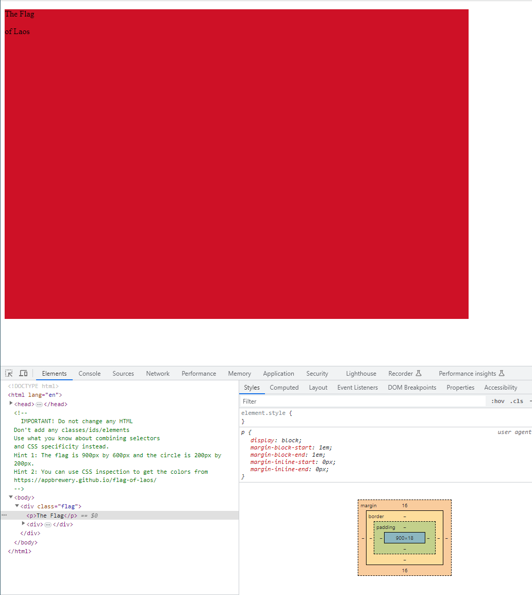
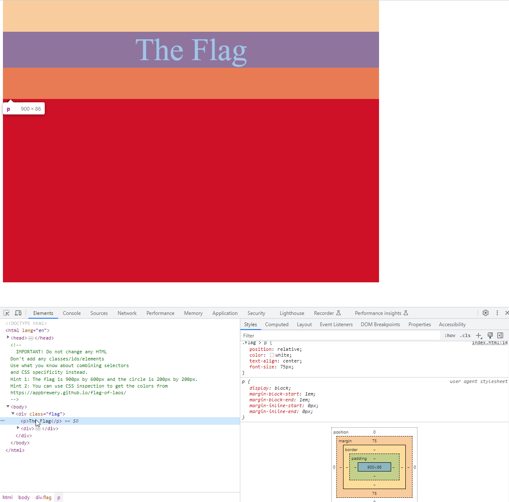
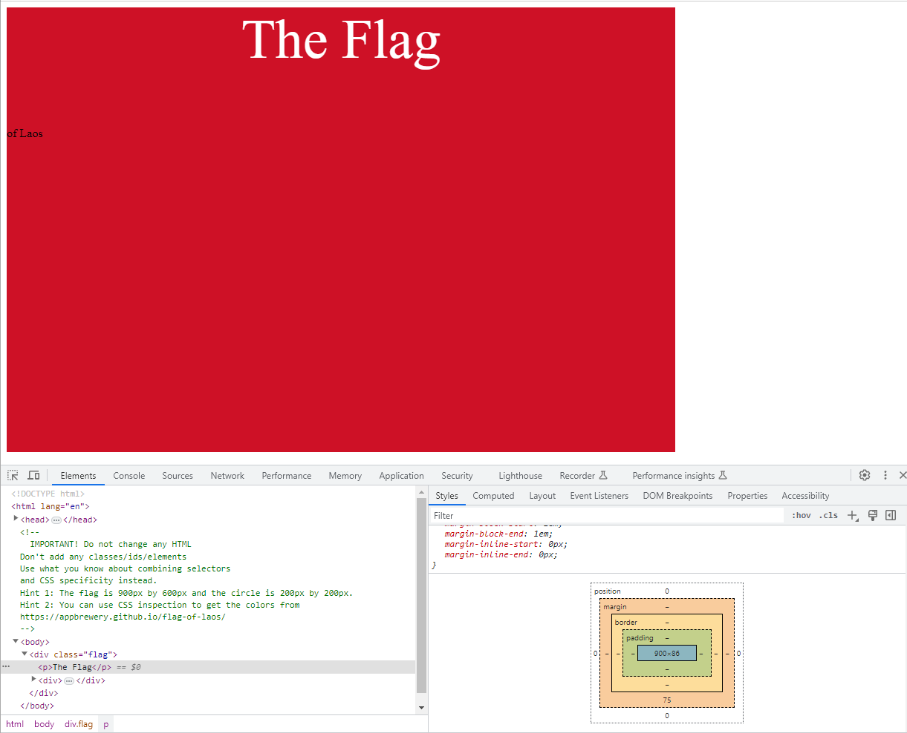
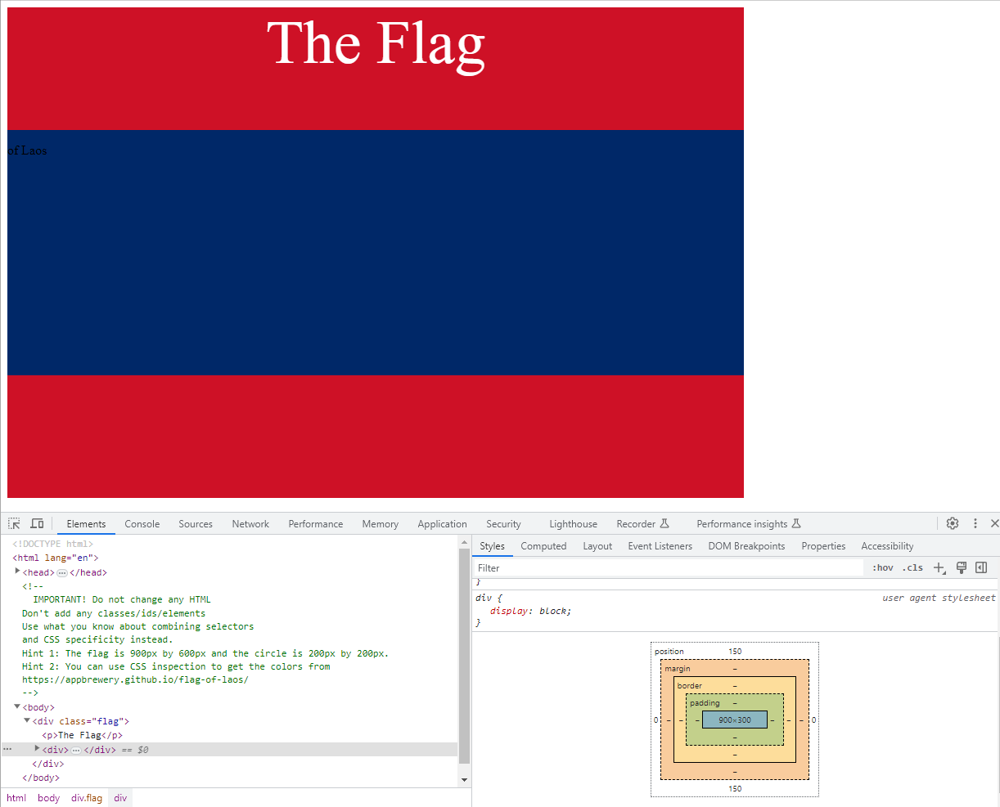
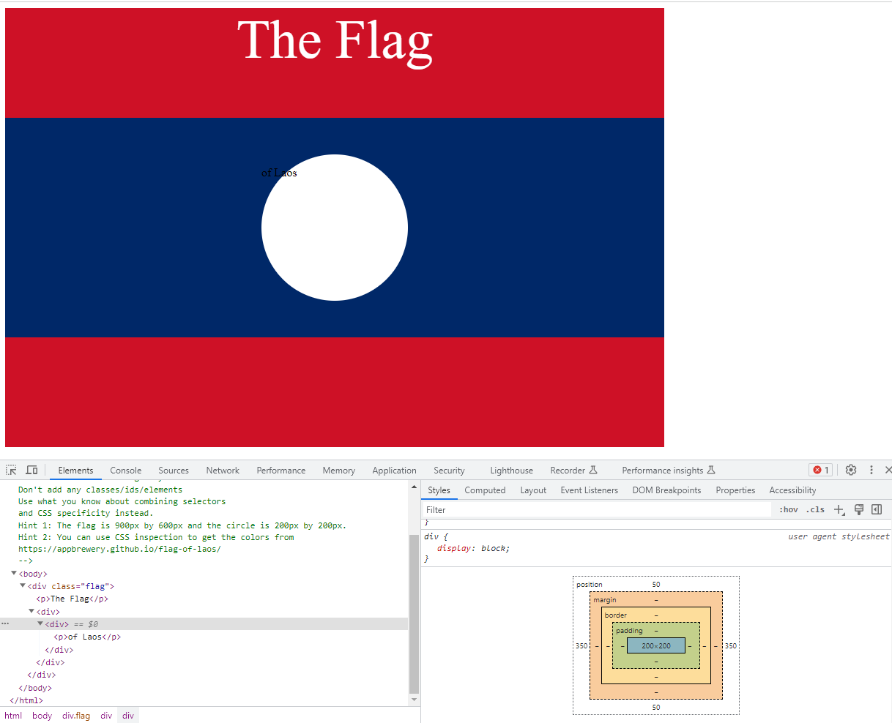
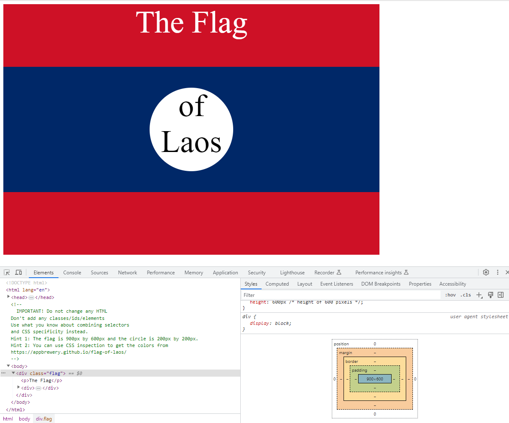

# css_flag_project
How to create a flag using CSS

This project corresponds to the CSS Flag Project in the Intermediate CSS Section.

Given the following html file:

```html
<!DOCTYPE html>
<html lang="en">

<head>
  <meta charset="UTF-8">
  <title>CSS Flag Project</title>
  <style>
    /* Write your CSS Code here */
    
  </style>
</head>

<!-- 
  IMPORTANT! Do not change any HTML
Don't add any classes/ids/elements 
Use what you know about combining selectors 
and CSS specificity instead.
Hint 1: The flag is 900px by 600px and the circle is 200px by 200px.
Hint 2: You can use CSS inspection to get the colors from
https://appbrewery.github.io/flag-of-laos/
-->

<body>
  <div class="flag">
    <p>The Flag</p>
    <div>
      <div>
        <p>of Laos</p>
      </div>
    </div>
  </div>
</body>

</html>
```

the goal is to create something like the following:


In order to do that, we are not allowed to modify any html elements. We can only add internal CSS rules inside the <style> tag. The idea is to combine selectors and play with the position property of the elements. My solution applies styling from top to bottom, starting with the div element tagged as flag and ending with the <p> element which contains the text "of Laos". So, let's get started!.

The div element tagged as flag is the container in which the rest of the elements are located and represents the whole flag. The width and the height are provided in the instructions of the exercise and the background color is taken using the css inspector on the url given. So this is how the element if styled:

```html
<style>
    .flag {
      position: relative;             /* This helps to position the first div tag */
      background-color: #ce1126;    /* Set the background color */
      width: 900px;                   /* width 900 pixels */
      height: 600px                   /* height of 600 pixels */
    }
</style>
```



So far not many changes. Next we will target the <p> element which contains the text "The Flag". This is the first child of the class flag element, so we can use the selectors combination .flag > p (Using this notation .flag is the parent and p is the direct child):

```html
<style>
    .flag {
      position: relative;             /* This helps to position the first div tag */
      background-color: #ce1126;    /* Set the background color */
      width: 900px;                   /* width 900 pixels */
      height: 600px                   /* height of 600 pixels */
    }
    .flag > p {                       /* With this selector combination we target the first <p> element of flag */
      position: relative;             /* Position relative to ancestor flag element */
      color: white;                 /* Text color white */
      text-align: center;             /* We align the text to the center of the flag */
      font-size: 75px;                /* Font size oif 75 pixels */
      margin-top: 0px;                /* needed to adjust the flag to the top of the browser after changing the font size */
    }
</style>
```
Playing with the font-size in the inspector, 75 pixels is what I believe is closer to the desired result. We will see that the text inside the white circle fits perfectly using a font size of 75 pixels as well. Note that I have set the margin-top property to 0. I don't know why but after changing the font-size property, a margin with the same amount of pixels is added both top and down the text:



After setting the margin-top to 0 we get the following result:



Next, we will target the center of the flag in blue. This is represented by the first <div> tag inside flag class. The background color has been taken from the URL given in the comments. This element has the same width and half the height of the flag element, that means 900 pixels and 300 pixels respectively.
NOTE: I'll change these fixed numbers and will use values relative to flag witdh and height so if these two change in the future, the size of the element will change accordingly. The position is set to absolute so it is relative to the position of the ancestor (Note that the flag element has the position property set) so to get it centered verticaly we have to push it 150 pixels from the top. This way we have 150 pixels on the top + 300 pixels as the height of the element + 150 pixels on the bottom = 600 pixels:

```html
  <style>
    .flag {
      position: relative;             /* This helps to position the first div tag */
      background-color: #ce1126;    /* Set the background color */
      width: 900px;                   /* width 900 pixels */
      height: 600px                   /* height of 600 pixels */
    }
    .flag > p {                       /* With this selector combination we target the first <p> element of flag */
      position: relative;             /* Position relative to ancestor flag element */
      color: white;                 /* Text color white */
      text-align: center;             /* We align the text to the center of the flag */
      font-size: 75px;                /* Font size oif 75 pixels */
      margin-top: 0px;                /* needed to adjust the flag to the top of the browser after changing the font size */
    }
    .flag > div {                     /* This represents the center of the flag */
      background-color: #002868;    /* set the background color */
      position: absolute;             /* With absolute, the position of the element is relative to the ancestor regardless its default position */
      height: 300px;                  /* the height is half the height of the flag */
      width: 900px;                   /* the width is the same as the width of the flag */
      top: 150px;                     /* The flag gets centered verticaly, leaving the same above up and below */
    }
</style>
```



Now we will target the second div tag which will represent the whiste circle. In order to select the correct div we will use *.flag > div div*. This means: select the div element which is a child of the first div inside flag element. If we had more than one div at that level, we could have used something like *.flag > div > div*. 


The position is set to absolute which makes the circle relative to the ancestor div element to make it easier to center. As usual, we set border-radius property to 50% to make a perfect cicle, set the background color and set width and heigth as instructed in the exercise. To center the circle both horizontally and vertically we need to adjust the left and pop properties. As the circle is inside the previous div, 900px width and 300px height, and has a width of 200px, we need to push it 50 pixels from the top of the previous div which leaves another 50px at the bottom having it centered vertically. Horizontally speaking, we need to push the circle 350px from the left which leaves another 350px at the rigth.

```html
<style>
    .flag {
      position: relative;             /* This helps to position the first div tag */
      background-color: #ce1126;    /* Set the background color */
      width: 900px;                   /* width 900 pixels */
      height: 600px                   /* height of 600 pixels */
    }
    .flag > p {                       /* With this selector combination we target the first <p> element of flag */
      position: relative;             /* Position relative to ancestor flag element */
      color: white;                 /* Text color white */
      text-align: center;             /* We align the text to the center of the flag */
      font-size: 75px;                /* Font size oif 75 pixels */
      margin-top: 0px;                /* needed to adjust the flag to the top of the browser after changing the font size */
    }
    .flag > div {                     /* This represents the center of the flag */
      background-color: #002868;    /* set the background color */
      position: absolute;             /* With absolute, the position of the element is relative to the ancestor regardless its default position */
      height: 300px;                  /* the height is half the height of the flag */
      width: 900px;                   /* the width is the same as the width of the flag */
      top: 150px;                     /* The flag gets centered verticaly, leaving the same above up and below */
    }
    .flag > div div {                 /* This represents the second div, the future white circle */
      border-radius: 50%;             /* make the circle */
      background-color: white;      /* set the background color */
      position: absolute;             /* The position is relative to the ancestor div element */
      width: 200px;                   /* witdh of 200 pixels */
      height: 200px;                  /* height of 200 pixels */
      left: 350px;                    /* The circle is centered horizontally in the ancestor div*/
      top: 50px;                      /* the circle is centered verticaly in the ancestor div */
    }
</style>
```



We are very close to the desired goal. Finally, we it's time to style the p element that contains the text "of Laos". We just center the text, increase the font-size to fit the space of the circle and remove the top margin as we did with the text "The Flag":

```html
<style>
    .flag {
      position: relative;             /* This helps to position the first div tag */
      background-color: #ce1126;    /* Set the background color */
      width: 900px;                   /* width 900 pixels */
      height: 600px                   /* height of 600 pixels */
    }
    .flag > p {                       /* With this selector combination we target the first <p> element of flag */
      position: relative;             /* Position relative to ancestor flag element */
      color: white;                 /* Text color white */
      text-align: center;             /* We align the text to the center of the flag */
      font-size: 75px;                /* Font size oif 75 pixels */
      margin-top: 0px;                /* needed to adjust the flag to the top of the browser after changing the font size */
    }
    .flag > div {                     /* This represents the center of the flag */
      background-color: #002868;    /* set the background color */
      position: absolute;             /* With absolute, the position of the element is relative to the ancestor regardless its default position */
      height: 300px;                  /* the height is half the height of the flag */
      width: 900px;                   /* the width is the same as the width of the flag */
      top: 150px;                     /* The flag gets centered verticaly, leaving the same above up and below */
    }
    .flag > div div {                 /* This represents the second div, the future white circle */
      border-radius: 50%;             /* make the circle */
      background-color: white;      /* set the background color */
      position: absolute;             /* The position is relative to the ancestor div element */
      width: 200px;                   /* witdh of 200 pixels */
      height: 200px;                  /* height of 200 pixels */
      left: 350px;                    /* The circle is centered horizontally in the ancestor div*/
      top: 50px;                      /* the circle is centered verticaly in the ancestor div */
    }
    .flag > div > div > p {           /* Lastly, we target the p element inside the circle*/
      text-align: center;             /* text centered */
      font-size: 75px;                /* font size of 75 pixels */
      margin-top: 0px;                /* we remove the margin created when setting the font size */
    }  
</style>
```

Final result:


What have we learnt in this exercise?
- Use both class and element selectors.
- Combine selectors to target specific html elements.
- Play with different values of the position property.

**Pending taks:**
- Remove duplicate code.
- Represent size of elements relative to their ancestors.


